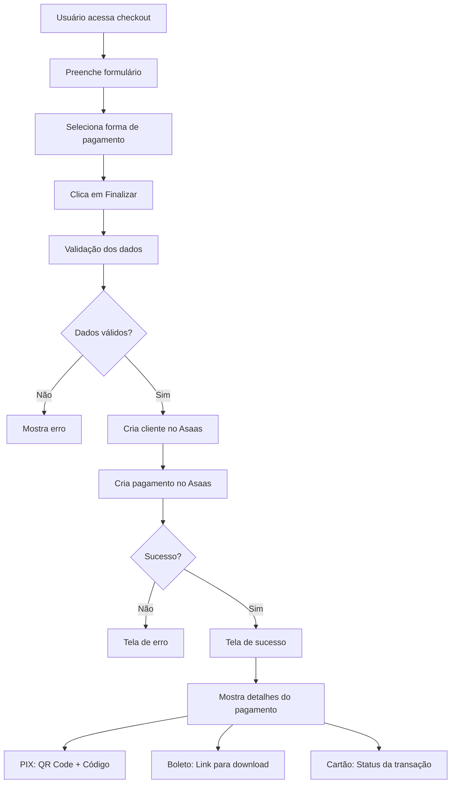

# Integração Asaas - Página de Checkout

## Visão Geral

A página de checkout foi totalmente integrada com a API do Asaas para processar pagamentos reais. A integração suporta três formas de pagamento:

- **PIX** - Pagamento instantâneo com QR Code
- **Boleto Bancário** - Boleto para pagamento offline
- **Cartão de Crédito** - Processamento direto via Asaas

## Funcionalidades Implementadas

### 1. Formulário de Checkout
- ✅ Validação completa de dados pessoais
- ✅ Validação específica para cartão de crédito
- ✅ Formatação automática de CPF, telefone e cartão
- ✅ Seleção de forma de pagamento
- ✅ Ciclo de cobrança (mensal/anual com desconto)

### 2. Processamento de Pagamentos
- ✅ Criação automática de cliente no Asaas
- ✅ Criação de pagamento com dados corretos
- ✅ Tratamento de erros da API
- ✅ Feedback visual para o usuário

### 3. Tela de Sucesso
- ✅ Exibição completa dos dados do pagamento
- ✅ QR Code PIX com imagem base64
- ✅ Código PIX para cópia
- ✅ Link para boleto bancário
- ✅ Link para fatura online
- ✅ Status badges coloridos

## API Routes Criadas

### `/api/asaas/customers`
- **POST**: Criar cliente no Asaas
- **GET**: Listar clientes

### `/api/asaas/payments`
- **POST**: Criar pagamento no Asaas
- **GET**: Listar pagamentos

## Fluxo de Pagamento



## Estrutura dos Dados

### Cliente (Customer)
```typescript
interface AsaasCustomer {
  name: string
  email: string
  cpfCnpj: string
  phone?: string
  mobilePhone?: string
}
```

### Pagamento (Payment)
```typescript
interface AsaasPayment {
  customer: string
  billingType: "PIX" | "BOLETO" | "CREDIT_CARD"
  value: number
  dueDate: string
  description: string
  externalReference?: string
  creditCard?: {
    holderName: string
    number: string
    expiryMonth: string
    expiryYear: string
    ccv: string
  }
}
```

## Estados da Aplicação

### 1. Form State
- Formulário inicial com dados pessoais
- Seleção de pagamento e ciclo
- Validações em tempo real

### 2. Processing State
- Loading durante criação do cliente
- Loading durante criação do pagamento
- Feedback visual com toast notifications

### 3. Success State
- Dados completos do pagamento
- QR Code PIX (se aplicável)
- Links para boleto/fatura
- Botões de navegação

### 4. Error State
- Mensagem de erro clara
- Opção de tentar novamente
- Botão para voltar aos planos

## Características Especiais

### PIX
- ✅ QR Code gerado automaticamente pelo Asaas
- ✅ Código PIX para cópia manual
- ✅ Imagem base64 renderizada diretamente
- ✅ Botão de cópia com feedback

### Boleto
- ✅ Link direto para visualização
- ✅ Download automático disponível
- ✅ Prazo de vencimento configurável

### Cartão de Crédito
- ✅ Validação de dados do cartão
- ✅ Informações do portador
- ✅ Processamento em tempo real
- ✅ Feedback imediato de aprovação/recusa

## Tratamento de Erros

### Erros Comuns
- Token Asaas inválido/ausente
- Dados obrigatórios faltando
- CPF inválido
- Cartão recusado
- Problemas de conectividade

### Feedback para Usuário
- Toast notifications para cada etapa
- Mensagens de erro específicas
- Estados de loading claros
- Opções de recuperação

## Configuração Necessária

### Variáveis de Ambiente
```bash
ASAAS_API_KEY=sua_chave_sandbox_aqui
```

### Dependências
- `sonner` - Toast notifications
- `lucide-react` - Ícones
- Componentes UI existentes

## Próximos Passos

### Melhorias Sugeridas
1. **Webhooks**: Implementar recebimento de webhooks do Asaas
2. **Assinaturas**: Criar assinaturas recorrentes
3. **Histórico**: Página de histórico de pagamentos
4. **Reembolsos**: Funcionalidade de estorno
5. **Relatórios**: Dashboard de pagamentos

### Segurança
1. **Rate Limiting**: Limitar tentativas de pagamento
2. **Validação Server-side**: Validações adicionais no backend
3. **Logs**: Sistema de auditoria completo
4. **Criptografia**: Dados sensíveis criptografados

## Testes

### Dados de Teste (Sandbox)
```bash
# Cartões de Teste
Aprovado: 5162306219378829
Recusado: 5162306219378837
CVV: 318
Validade: 05/2030

# CPFs de Teste
Válido: 24971563792
Válido: 86423335882
```

### Cenários de Teste
- ✅ Pagamento PIX aprovado
- ✅ Pagamento cartão aprovado
- ✅ Pagamento cartão recusado
- ✅ Boleto gerado
- ✅ Dados inválidos
- ✅ Erro de conectividade

## Status da Integração

🟢 **CONCLUÍDO**: Integração básica funcionando
🟢 **CONCLUÍDO**: Todas as formas de pagamento
🟢 **CONCLUÍDO**: Telas de sucesso/erro
🟢 **CONCLUÍDO**: Validações completas
🟡 **PENDENTE**: Webhooks
🟡 **PENDENTE**: Assinaturas recorrentes
🟡 **PENDENTE**: Histórico de pagamentos

---

**Última atualização**: 24/06/2025
**Versão**: 1.0.0
**Status**: Produção (Sandbox) 