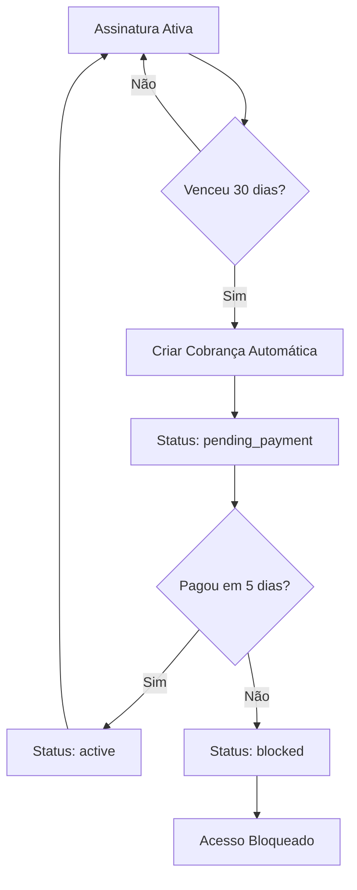

# Sistema de Assinatura Automática - RX Veículos

## 📋 Visão Geral

Sistema completo de cobrança automática com duração de 30 dias corridos, período de tolerância de 5 dias e bloqueio automático para usuários inadimplentes.

## 🏗️ Arquitetura do Sistema

### 1. **Tabela de Assinaturas (`user_subscriptions`)**
```sql
- id: UUID (chave primária)
- user_id: UUID (referência ao usuário)
- plan_type: TEXT (basico, premium, premium_plus)
- plan_value: DECIMAL (valor do plano)
- start_date: TIMESTAMP (início da assinatura)
- end_date: TIMESTAMP (vencimento - 30 dias após start_date)
- status: TEXT (active, pending_payment, blocked, cancelled)
- last_payment_id: TEXT (ID do último pagamento no Asaas)
- asaas_customer_id: TEXT (ID do cliente no Asaas)
- grace_period_ends_at: TIMESTAMP (fim do período de tolerância - 5 dias após end_date)
```

### 2. **Estados da Assinatura**

| Status | Descrição | Acesso ao Painel |
|--------|-----------|------------------|
| `active` | Assinatura ativa e em dia | ✅ Liberado |
| `pending_payment` | Vencida, dentro do período de tolerância | ✅ Liberado com aviso |
| `blocked` | Vencida há mais de 5 dias | ❌ Bloqueado |
| `cancelled` | Cancelada pelo usuário | ❌ Bloqueado |

### 3. **Fluxo de Funcionamento**



## 🔧 Configuração

### 1. **Variáveis de Ambiente**
```bash
# .env
ASAAS_API_URL=https://api-sandbox.asaas.com/v3
ASAAS_API_KEY=sua_chave_sandbox
ASAAS_PIX_KEY=sua_chave_pix
CRON_SECRET_KEY=chave_secreta_para_cron
```

### 2. **Configuração do Banco de Dados**
```bash
# Executar script SQL
psql -h your-host -d your-db -f scripts/create-subscriptions-table.sql
```

### 3. **Configuração do Cron Job**
```bash
# Executar todo dia às 9h
0 9 * * * /usr/bin/node /caminho/para/projeto/scripts/auto-billing-cron.js

# Para teste (a cada minuto)
* * * * * /usr/bin/node /caminho/para/projeto/scripts/auto-billing-cron.js
```

## 📡 APIs Disponíveis

### 1. **Gerenciar Assinaturas** (`/api/subscriptions`)

#### GET - Buscar Assinatura
```bash
GET /api/subscriptions?userId=uuid
```

**Resposta:**
```json
{
  "subscription": {
    "id": "uuid",
    "plan_type": "premium",
    "plan_value": 59.90,
    "status": "active",
    "end_date": "2024-02-15T00:00:00Z",
    "grace_period_ends_at": null
  },
  "access": {
    "hasAccess": true,
    "subscription": {...},
    "reason": null
  },
  "plans": {
    "basico": { "value": 29.90, "name": "Básico" },
    "premium": { "value": 59.90, "name": "Premium" },
    "premium_plus": { "value": 99.90, "name": "Premium Plus" }
  }
}
```

#### POST - Criar Assinatura
```bash
POST /api/subscriptions
Content-Type: application/json

{
  "userId": "uuid",
  "planType": "premium",
  "asaasCustomerId": "cus_123456"
}
```

#### PUT - Atualizar Status
```bash
PUT /api/subscriptions
Content-Type: application/json

{
  "subscriptionId": "uuid",
  "status": "blocked",
  "paymentId": "pay_123456"
}
```

### 2. **Cobrança Automática** (`/api/subscriptions/auto-billing`)

#### POST - Processar Cobranças (Cron Job)
```bash
POST /api/subscriptions/auto-billing
Authorization: Bearer sua_chave_secreta
```

**Resposta:**
```json
{
  "message": "Processamento de cobrança automática concluído",
  "results": {
    "processedExpired": 3,
    "processedBlocked": 1,
    "totalExpired": 3,
    "totalBlocked": 1,
    "errors": []
  }
}
```

#### GET - Status do Sistema
```bash
GET /api/subscriptions/auto-billing
```

## 🛡️ Sistema de Proteção (SubscriptionGuard)

### Uso do Componente
```tsx
import SubscriptionGuard from '@/components/subscription-guard'

export default function PainelAgencia() {
  return (
    <SubscriptionGuard redirectTo="/planos">
      <div>Conteúdo protegido aqui</div>
    </SubscriptionGuard>
  )
}
```

### Comportamentos

1. **Acesso Liberado**: Mostra conteúdo normalmente
2. **Pagamento Pendente**: Mostra aviso laranja + conteúdo
3. **Acesso Bloqueado**: Mostra tela de bloqueio com opções de pagamento

## 🔄 Processo de Cobrança Automática

### 1. **Verificação Diária**
- Script roda todo dia às 9h
- Busca assinaturas com `status = 'active'` e `end_date < now()`
- Busca assinaturas com `status = 'pending_payment'` e `grace_period_ends_at < now()`

### 2. **Para Assinaturas Vencidas**
1. Cria cobrança PIX no Asaas
2. Atualiza status para `pending_payment`
3. Define `grace_period_ends_at` (5 dias)
4. Salva `last_payment_id`

### 3. **Para Assinaturas em Atraso**
1. Verifica se `grace_period_ends_at` passou
2. Atualiza status para `blocked`
3. Usuário perde acesso ao painel

## 🧪 Testes

### 1. **Página de Teste**
```
http://localhost:3000/teste-assinatura-sistema
```

### 2. **Script de Teste**
```bash
# Verificar configuração
node scripts/auto-billing-cron.js --check

# Verificar status da API
node scripts/auto-billing-cron.js --status

# Executar processamento
node scripts/auto-billing-cron.js
```

### 3. **Cenários de Teste**
1. ✅ Criar assinatura ativa
2. ✅ Simular vencimento (alterar end_date)
3. ✅ Executar cobrança automática
4. ✅ Verificar criação de cobrança PIX
5. ✅ Simular período de tolerância
6. ✅ Simular bloqueio após 5 dias
7. ✅ Testar SubscriptionGuard em diferentes status

## 📊 Planos Disponíveis

```typescript
PLAN_CONFIGS = {
  basico: { value: 29.90, name: 'Básico' },
  premium: { value: 59.90, name: 'Premium' },
  premium_plus: { value: 99.90, name: 'Premium Plus' }
}
```

## 🔍 Monitoramento

### 1. **Logs do Cron Job**
```bash
# Ver logs em tempo real
tail -f /var/log/cron.log | grep auto-billing

# Logs do script
/caminho/para/projeto/logs/auto-billing.log
```

### 2. **Verificação Manual**
```sql
-- Assinaturas vencidas
SELECT * FROM user_subscriptions 
WHERE status = 'active' AND end_date < NOW();

-- Assinaturas para bloqueio
SELECT * FROM user_subscriptions 
WHERE status = 'pending_payment' 
AND grace_period_ends_at < NOW();
```

### 3. **Estatísticas**
```sql
-- Resumo por status
SELECT status, COUNT(*) as total 
FROM user_subscriptions 
GROUP BY status;

-- Receita mensal
SELECT 
  DATE_TRUNC('month', start_date) as mes,
  SUM(plan_value) as receita
FROM user_subscriptions 
WHERE status IN ('active', 'pending_payment')
GROUP BY mes
ORDER BY mes DESC;
```

## 🚨 Troubleshooting

### Problemas Comuns

1. **Cron não executa**
   - Verificar permissões do script: `chmod +x scripts/auto-billing-cron.js`
   - Verificar caminho do Node.js: `which node`
   - Verificar logs: `sudo tail -f /var/log/cron.log`

2. **API retorna erro 401**
   - Verificar `CRON_SECRET_KEY` no `.env`
   - Verificar header de autorização no script

3. **Cobranças não são criadas**
   - Verificar configuração Asaas (`ASAAS_API_KEY`, `ASAAS_API_URL`)
   - Verificar se `asaas_customer_id` está salvo nas assinaturas
   - Verificar logs da API do Asaas

4. **SubscriptionGuard sempre bloqueia**
   - Verificar se API `/api/subscriptions` está funcionando
   - Verificar se usuário tem assinatura criada
   - Verificar status da assinatura no banco

### Comandos de Debug
```bash
# Testar API diretamente
curl -X GET "http://localhost:3000/api/subscriptions?userId=USER_ID"

# Testar cobrança automática
curl -X POST "http://localhost:3000/api/subscriptions/auto-billing" \
  -H "Authorization: Bearer YOUR_SECRET_KEY"

# Verificar status do sistema
curl -X GET "http://localhost:3000/api/subscriptions/auto-billing"
```

## ✅ Checklist de Implementação

- [x] Tabela `user_subscriptions` criada
- [x] APIs de gerenciamento implementadas
- [x] API de cobrança automática implementada
- [x] SubscriptionGuard atualizado
- [x] Script de cron job criado
- [x] Página de teste criada
- [x] Documentação completa
- [ ] Configurar cron job em produção
- [ ] Configurar logs de monitoramento
- [ ] Testar em ambiente de produção

## 🔄 Próximos Passos

1. **Notificações por Email**
   - Avisar 3 dias antes do vencimento
   - Avisar quando muda para pending_payment
   - Avisar quando é bloqueado

2. **Dashboard Administrativo**
   - Ver todas as assinaturas
   - Relatórios de receita
   - Gestão de inadimplentes

3. **Webhooks do Asaas**
   - Atualizar status automaticamente quando pagamento é confirmado
   - Reativar assinatura automaticamente

4. **Desconto e Promoções**
   - Cupons de desconto
   - Primeiro mês grátis
   - Planos anuais com desconto 