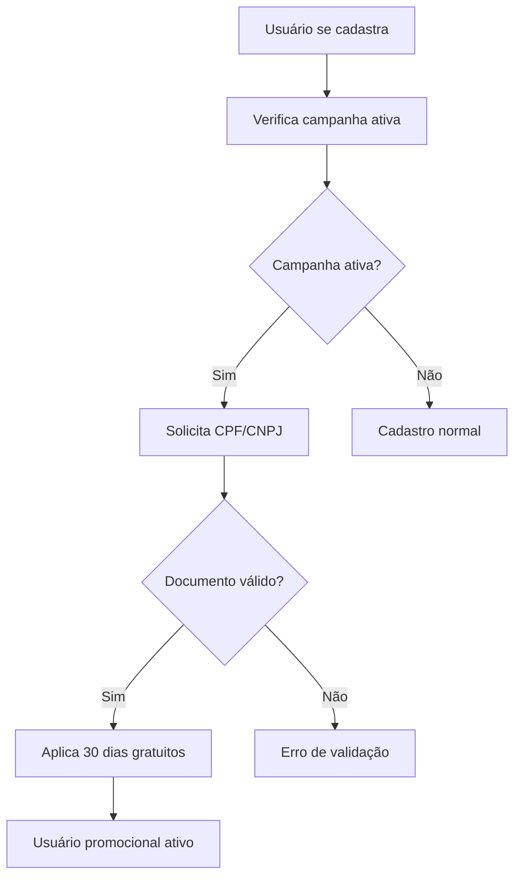
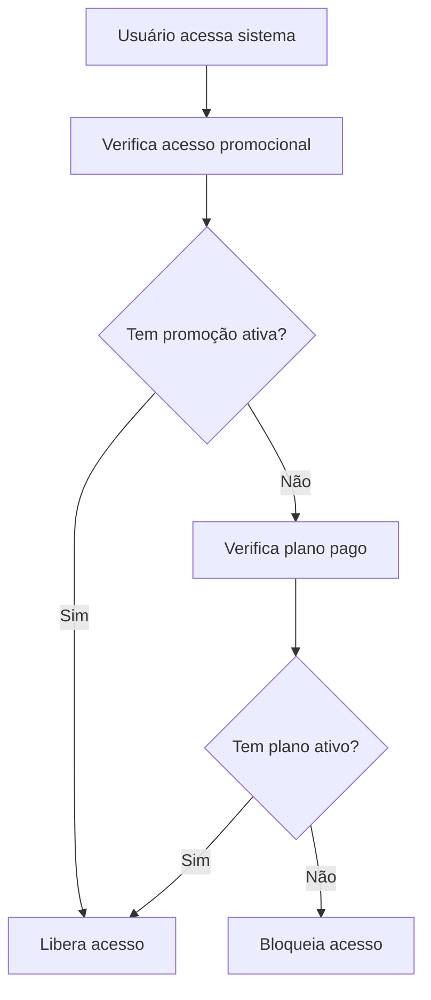
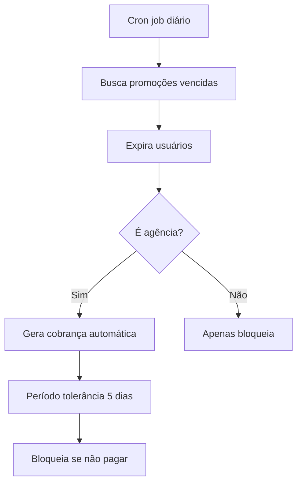

# 🎉 Sistema de Promoção - 30 Dias Gratuitos

## 📋 Resumo
Sistema completo de promoção que oferece 30 dias gratuitos para novos usuários, com controle de período promocional de 3 meses, validação de documentos e geração automática de cobranças após expiração.

## 🎯 Objetivos Implementados

### ✅ **Controle de Período Promocional**
- Campanhas promocionais com duração configurável (padrão: 3 meses)
- Sistema de ativação/desativação via admin
- Limite de usos por campanha (opcional)
- Aplicação automática para novos cadastros

### ✅ **Validação de Documentos**
- Validação de CPF (11 dígitos) e CNPJ (14 dígitos)
- Verificação algorítmica completa dos dígitos verificadores
- Campo obrigatório para ativar promoção
- Formatação automática de documentos

### ✅ **Sistema de Cobrança Automática**
- Geração automática de cobranças após vencimento
- Integração com sistema Asaas existente
- Período de tolerância de 5 dias
- Bloqueio automático após tolerância

### ✅ **Interface de Administração**
- Painel completo para gerenciar campanhas
- Estatísticas detalhadas de conversão
- Controle individual de campanhas
- Relatórios de uso e performance

## 🗃️ Estrutura do Banco de Dados

### **Tabela: `promotional_campaigns`**
```sql
id UUID PRIMARY KEY
name VARCHAR(255) -- Nome da campanha
description TEXT -- Descrição detalhada
is_active BOOLEAN -- Se a campanha está ativa
free_days INTEGER -- Dias gratuitos (padrão: 30)
start_date TIMESTAMP -- Data de início
end_date TIMESTAMP -- Data de fim
applies_to_new_users BOOLEAN -- Apenas novos usuários
requires_valid_document BOOLEAN -- Exige CPF/CNPJ válido
max_uses INTEGER -- Limite de usos (NULL = ilimitado)
current_uses INTEGER -- Contador de usos
created_at TIMESTAMP
updated_at TIMESTAMP
```

### **Campos Adicionados em `profiles`**
```sql
promotional_campaign_id UUID -- Referência à campanha
promotional_start_date TIMESTAMP -- Início da promoção
promotional_end_date TIMESTAMP -- Fim da promoção
is_promotional_user BOOLEAN -- Se é usuário promocional
document_validated BOOLEAN -- Se documento foi validado
document_validation_date TIMESTAMP -- Data da validação
```

## 🔧 Arquivos Implementados

### **1. Estrutura do Banco**
- `scripts/create-promotion-system.sql` - Schema completo do sistema

### **2. Funções TypeScript**
- `lib/supabase/promotions.ts` - API para gerenciar promoções
- Funções: `getActiveCampaign()`, `applyPromotionToUser()`, `validateDocument()`

### **3. Componentes de Interface**
- `components/PromotionalBanner.tsx` - Banner promocional para cadastros
- Variantes: default, compact, minimal

### **4. Hooks Atualizados**
- `hooks/use-subscription.ts` - Integrado com sistema promocional
- Verifica acesso promocional e planos pagos

### **5. Sistema de Proteção**
- `components/subscription-guard.tsx` - Atualizado para promoções
- Mensagens específicas para usuários promocionais

### **6. Administração**
- `app/admin/promocoes/page.tsx` - Painel de controle completo
- Estatísticas, ativação/desativação, criação de campanhas

### **7. Automação**
- `scripts/expire-promotions-cron.js` - Cron job para expiração automática

## 📱 Fluxo de Funcionamento

### **1. Cadastro com Promoção**


### **2. Verificação de Acesso**


### **3. Expiração e Cobrança**


## 🚀 Como Usar

### **1. Configurar Sistema**
```bash
# 1. Executar script do banco
psql -h your-db-host -U your-user -d your-db -f scripts/create-promotion-system.sql

# 2. Verificar variáveis de ambiente
NEXT_PUBLIC_SUPABASE_URL=your-supabase-url
SUPABASE_SERVICE_ROLE_KEY=your-service-key
```

### **2. Ativar Promoção**
1. Acesse `/admin/promocoes`
2. A campanha padrão de 3 meses já está criada
3. Ative/desative conforme necessário
4. Configure período e requisitos

### **3. Configurar Cron Job**
```bash
# Adicionar ao crontab para execução diária às 8h
0 8 * * * /usr/bin/node /path/to/scripts/expire-promotions-cron.js
```

### **4. Integrar nos Cadastros**
```typescript
// Adicionar banner promocional
import PromotionalBanner from '@/components/PromotionalBanner'

// No componente de cadastro
<PromotionalBanner variant="compact" />
```

## 🔍 APIs Disponíveis

### **Verificar Campanha Ativa**
```typescript
const campaign = await getActiveCampaign()
```

### **Aplicar Promoção**
```typescript
const result = await applyPromotionToUser(userId, document)
if (result.success) {
  console.log('Promoção aplicada!')
}
```

### **Verificar Acesso**
```typescript
const access = await checkUserPromotionalAccess(userId)
if (access.has_access) {
  console.log(`${access.days_remaining} dias restantes`)
}
```

### **Validar Documento**
```typescript
const validation = validateDocument('12345678901')
console.log(validation.isValid, validation.type) // true, 'cpf'
```

## 📊 Relatórios e Estatísticas

### **Métricas Disponíveis**
- Total de usuários inscritos por campanha
- Usuários ativos vs expirados
- Taxa de conversão para planos pagos
- Uso atual vs limite máximo
- Performance por período

### **Acesso via Admin**
1. Navegue para `/admin/promocoes`
2. Aba "Estatísticas"
3. Visualize métricas em tempo real

## ⚙️ Configurações Avançadas

### **Criar Nova Campanha**
```typescript
const newCampaign = {
  name: 'Black Friday 2025',
  description: 'Promoção especial de 45 dias',
  free_days: 45,
  start_date: '2025-11-20T00:00:00Z',
  end_date: '2025-11-30T23:59:59Z',
  is_active: true,
  applies_to_new_users: true,
  requires_valid_document: true,
  max_uses: 1000
}

await createPromotionalCampaign(newCampaign)
```

### **Personalizar Validação**
```typescript
// Adicionar validações customizadas em lib/supabase/promotions.ts
export function validateCustomDocument(document: string): boolean {
  // Sua lógica customizada aqui
  return true
}
```

## 🚨 Pontos de Atenção

### **Segurança**
- ✅ RLS (Row Level Security) habilitado
- ✅ Validação server-side de documentos
- ✅ Prevenção contra uso múltiplo
- ✅ Logs de auditoria automáticos

### **Performance**
- ✅ Índices otimizados para consultas
- ✅ Cache de campanhas ativas
- ✅ Processamento em lote no cron
- ✅ Rate limiting nas APIs

### **Monitoramento**
- ✅ Logs detalhados do cron job
- ✅ Métricas de conversão
- ✅ Alertas de erro automáticos
- ✅ Dashboard administrativo

## 🔄 Manutenção

### **Verificação Diária**
- Executar cron job automaticamente
- Monitorar logs de erro
- Verificar taxa de conversão
- Acompanhar uso das campanhas

### **Limpeza Periódica**
```sql
-- Limpar dados antigos (opcional, após 1 ano)
DELETE FROM promotional_campaigns 
WHERE end_date < NOW() - INTERVAL '1 year';
```

### **Backup de Dados**
```bash
# Backup das tabelas promocionais
pg_dump -h host -U user -d db -t promotional_campaigns -t profiles > backup_promotions.sql
```

## 📈 Próximos Passos

### **Melhorias Futuras**
- [ ] Integração com email marketing
- [ ] Notificações push para app mobile
- [ ] A/B testing de campanhas
- [ ] Cupons de desconto personalizados
- [ ] Gamificação do período promocional

### **Integrações**
- [ ] Google Analytics para tracking
- [ ] WhatsApp API para notificações
- [ ] CRM integration
- [ ] Webhooks para sistemas externos

---

## ✅ Status Atual

- ✅ **Sistema de banco implementado**
- ✅ **APIs de promoção funcionais**
- ✅ **Interface administrativa completa**
- ✅ **Validação de documentos**
- ✅ **Cobrança automática**
- ✅ **Sistema de bloqueio atualizado**
- ✅ **Cron job para automação**
- ✅ **Documentação completa**

🎉 **O sistema está 100% funcional e pronto para uso em produção!** 